# ClacOxygen - Documentation client

Ce dossier contient le client Kotlin Compose Multiplatform (Android, iOS, Desktop, Web/Wasm).
Le client consomme l'API Ktor du serveur et partage un maximum de code UI et métier dans [src/commonMain](src/commonMain).

**Liens utiles :**
- [Retour à la documentation générale](../README.md)
- [Voir la documentation du Backend (Server)](../server/README.md)

## Sommaire

1. [Objectif du module](#1-objectif-du-module)
2. [Architecture du client](#2-architecture-du-client)
3. [Points d'entrée par plateforme](#3-points-dentree-par-plateforme)
4. [Navigation et écrans](#4-navigation-et-ecrans)
5. [État, ViewModels et logique métier](#5-etat-viewmodels-et-logique-metier)
6. [Couche données et repositories](#6-couche-donnees-et-repositories)
7. [Configuration du serveur et base URL](#7-configuration-du-serveur-et-base-url)
8. [Authentification et stockage des tokens](#8-authentification-et-stockage-des-tokens)
9. [OAuth par plateforme](#9-oauth-par-plateforme)
10. [Composants UI réutilisables](#10-composants-ui-reutilisables)
11. [Ressources et assets](#11-ressources-et-assets)
12. [Où modifier quoi](#12-ou-modifier-quoi)
13. [Ajouter une nouvelle fonctionnalité](#13-ajouter-une-nouvelle-fonctionnalite)
14. [Dépannage côté client](#14-depannage-cote-client)
15. [Pages illustrées et modifications](#15-pages-illustrees-et-modifications)

## 1. Objectif du module

Le module `composeApp` fournit une application unique pour :

- afficher les formations, blocs et cours,
- consulter fiches, ressources et professeurs,
- afficher un calendrier et un horaire,
- gérer les cours personnels,
- connecter l'utilisateur avec un token JWT.

## 2. Architecture du client

Structure des sources :

```
composeApp/
|-- src/
|   |-- commonMain/
|   |   |-- kotlin/
|   |   |   |-- be/ecam/companion/
|   |   |   |   |-- App.kt                            # orchestration UI, navigation, thèmes
|   |   |   |   |-- di/di.kt                          # injection Koin + buildBaseUrl
|   |   |   |   |-- viewmodel/
|   |   |   |   |   |-- LoginViewModel.kt             # auth, session, token
|   |   |   |   |   |-- HomeViewModel.kt              # PAE + cours + catalogue
|   |   |   |   |-- data/
|   |   |   |   |   |-- ApiRepository.kt              # endpoints de base
|   |   |   |   |   |-- KtorApiRepository.kt          # impl HTTP
|   |   |   |   |   |-- CalendarRepository.kt         # calendrier + horaires
|   |   |   |   |   |-- CourseDetailsRepository.kt    # agrégation fiches de cours
|   |   |   |   |   |-- CourseResourceRepository.kt   # ressources de cours
|   |   |   |   |   |-- FormationCatalogRepository.kt # formations + blocs
|   |   |   |   |   |-- ProfessorRepository.kt        # professeurs + cours
|   |   |   |   |   |-- PaeRepository.kt              # PAE et notes
|   |   |   |   |   |-- UserCoursesRepository.kt      # cours sélectionnés
|   |   |   |   |   |-- SettingsRepository.kt         # host/port serveur
|   |   |   |   |   |-- InMemorySettingsRepository.kt # settings web
|   |   |   |   |   |-- DefaultServer.kt              # base URL attendue
|   |   |   |   |-- ui/
|   |   |   |   |   |-- screens/                      # écrans principaux
|   |   |   |   |   |   |-- LoginScreen.kt            # connexion + OAuth
|   |   |   |   |   |   |-- RegisterScreen.kt         # inscription locale
|   |   |   |   |   |   |-- HomeScreen.kt             # accueil + cours + recherche
|   |   |   |   |   |   |-- CoursesFormationScreen.kt # formations + blocs
|   |   |   |   |   |   |-- CoursesFormationBlocScreen.kt # détails bloc + cours
|   |   |   |   |   |   |-- CoursesFicheScreen.kt     # fiche cours (ECTS)
|   |   |   |   |   |   |-- CoursesResourcesScreen.kt # ressources de cours
|   |   |   |   |   |   |-- CoursesComponentScreen.kt # composants de cours
|   |   |   |   |   |   |-- CalendarScreen.kt         # calendrier principal
|   |   |   |   |   |   |-- CalendarEvents.kt         # modèles et helpers calendrier
|   |   |   |   |   |   |-- MonPaeScreen.kt           # PAE + notes
|   |   |   |   |   |   |-- ProfessorsScreen.kt       # annuaire professeurs
|   |   |   |   |   |   |-- UserDashboardScreen.kt    # tableau de bord utilisateur
|   |   |   |   |   |   |-- SettingsScreen.kt         # réglages UI + token
|   |   |   |   |   |-- components/                   # composants réutilisables
|   |   |   |   |   |   |-- TopBar.kt                 # barre du haut
|   |   |   |   |   |   |-- BottomBar.kt              # barre du bas
|   |   |   |   |   |   |-- BottomItem.kt             # items de navigation
|   |   |   |   |   |   |-- AppDrawer.kt              # menu latéral
|   |   |   |   |   |   |-- StudentCourseCalendar.kt  # calendrier étudiant
|   |   |   |   |   |   |-- CourseFilterBar.kt        # filtres calendrier
|   |   |   |   |   |   |-- CourseEvent.kt            # modèle événement cours
|   |   |   |   |   |   |-- CourseEventExtensions.kt  # extensions événements
|   |   |   |   |   |   |-- CourseEventsLoader.kt     # loader événements
|   |   |   |   |   |   |-- NotificationWidget.kt     # notifications UI
|   |   |   |   |   |   |-- KamelImage.kt             # affichage images
|   |   |   |   |   |   |-- EcamBackground.kt         # fond écran login
|   |   |   |   |   |-- theme/                        # thème et accessibilité
|   |   |   |   |   |   |-- ThemeMode.kt              # thèmes clair/sombre
|   |   |   |   |   |   |-- TextScaleMode.kt          # échelle texte
|   |   |   |   |   |   |-- ScreenSizeMode.kt         # échelle écran
|   |   |   |   |   |   |-- AppSettingsController.kt  # contrôleur des réglages
|   |   |   |   |   |   |-- SystemSettings.kt         # détection réglages système
|   |   |   |   |   |   |-- PlatformInsets.kt         # padding par plateforme
|   |   |   |   |-- utils/
|   |   |   |   |   |-- TokenStorage.kt               # token par plateforme
|   |   |-- composeResources/
|   |   |   |-- drawable/                             # images
|   |   |   |-- files/                                # JSON de données
|   |   |   |-- values/                               # strings.xml
|   |-- androidMain/
|   |   |-- kotlin/be/ecam/companion/
|   |   |   |-- MainActivity.kt                       # entry point Android
|   |   |   |-- data/PersistentSettingsRepository.android.kt # settings persistants Android
|   |   |   |-- data/DefaultServer.android.kt         # URL serveur par defaut Android
|   |   |   |-- utils/TokenStorage.kt                 # stockage token Android (TODO)
|   |   |   |-- ui/components/Base64Image.android.kt  # rendu image Base64 Android
|   |   |   |-- ui/theme/ScreenSizeMode.android.kt    # taille ecran Android
|   |   |   |-- ui/theme/PlatformInsets.android.kt    # insets Android
|   |   |   |-- ui/theme/SystemSettings.android.kt    # réglages système Android
|   |-- iosMain/
|   |   |-- kotlin/be/ecam/companion/
|   |   |   |-- MainViewController.kt                 # entry point iOS
|   |   |   |-- data/PersistentSettingsRepository.ios.kt # settings persistants iOS
|   |   |   |-- data/DefaultServer.ios.kt             # URL serveur par defaut iOS
|   |   |   |-- utils/TokenStorage.kt                 # stockage token iOS
|   |   |   |-- ui/components/Base64Image.ios.kt      # rendu image Base64 iOS
|   |   |   |-- ui/theme/ScreenSizeMode.ios.kt        # taille ecran iOS
|   |   |   |-- ui/theme/PlatformInsets.ios.kt        # insets iOS
|   |   |   |-- ui/theme/SystemSettings.ios.kt        # réglages système iOS
|   |-- jvmMain/
|   |   |-- kotlin/be/ecam/companion/
|   |   |   |-- main.kt                               # entry point Desktop
|   |   |   |-- data/PersistentSettingsRepository.jvm.kt # settings persistants Desktop
|   |   |   |-- data/DefaultServer.jvm.kt             # URL serveur par defaut Desktop
|   |   |   |-- oauth/DesktopOAuthHelper.kt           # OAuth Desktop
|   |   |   |-- utils/TokenStorage.kt                 # stockage token Desktop
|   |   |   |-- ui/components/Base64Image.jvm.kt      # rendu image Base64 Desktop
|   |   |   |-- ui/theme/ScreenSizeMode.jvm.kt        # taille ecran Desktop
|   |   |   |-- ui/theme/PlatformInsets.jvm.kt        # insets Desktop
|   |   |   |-- ui/theme/SystemSettings.jvm.kt        # réglages système Desktop
|   |-- wasmJsMain/
|   |   |-- kotlin/be/ecam/companion/
|   |   |   |-- main.kt                               # entry point Web/Wasm
|   |   |   |-- data/DefaultServer.wasmJs.kt          # URL serveur par defaut Web
|   |   |   |-- utils/TokenStorage.kt                 # stockage token Web
|   |   |   |-- ui/components/Base64Image.wasmJs.kt   # rendu image Base64 Web
|   |   |   |-- ui/theme/ScreenSizeMode.wasmJs.kt     # taille ecran Web
|   |   |   |-- ui/theme/PlatformInsets.wasmJs.kt     # insets Web
|   |   |   |-- ui/theme/SystemSettings.wasmJs.kt     # réglages système Web
```

Organisation logique :

- UI : [src/commonMain/kotlin/be/ecam/companion/ui](src/commonMain/kotlin/be/ecam/companion/ui)
- ViewModels : [src/commonMain/kotlin/be/ecam/companion/viewmodel](src/commonMain/kotlin/be/ecam/companion/viewmodel)
- Data / API : [src/commonMain/kotlin/be/ecam/companion/data](src/commonMain/kotlin/be/ecam/companion/data)
- DI : [src/commonMain/kotlin/be/ecam/companion/di](src/commonMain/kotlin/be/ecam/companion/di)
- Utils : [src/commonMain/kotlin/be/ecam/companion/utils](src/commonMain/kotlin/be/ecam/companion/utils)

## 3. Points d'entrée par plateforme

Android
---

- [MainActivity.kt](src/androidMain/kotlin/be/ecam/companion/MainActivity.kt)
- Injecte `SettingsRepository` persistant.
- Gère un deep link OAuth (schéma `be.ecam.companion://auth-callback`).

iOS
---

- [MainViewController.kt](src/iosMain/kotlin/be/ecam/companion/MainViewController.kt)
- Monte l'app Compose via `ComposeUIViewController`.
- Injecte `SettingsRepository` persistant.

Desktop (JVM)
---

- [main.kt](src/jvmMain/kotlin/be/ecam/companion/main.kt)
- Monte la fenêtre Compose.
- Démarre un serveur local OAuth via [DesktopOAuthHelper.kt](src/jvmMain/kotlin/be/ecam/companion/oauth/DesktopOAuthHelper.kt).
- Injecte `SettingsRepository` persistant.

Web/Wasm
---

- [main.kt](src/wasmJsMain/kotlin/be/ecam/companion/main.kt)
- Monte l'app avec `ComposeViewport`.
- Lit les tokens OAuth dans l'URL, les stocke dans `localStorage`.
- Injecte `SettingsRepository` en mémoire.

## 4. Navigation et écrans

La navigation est gérée dans [App.kt](src/commonMain/kotlin/be/ecam/companion/App.kt).
Les écrans sont des composables `@Composable` dans [src/commonMain/kotlin/be/ecam/companion/ui/screens/](src/commonMain/kotlin/be/ecam/companion/ui/screens/).

Écrans principaux :
---

- [LoginScreen.kt](src/commonMain/kotlin/be/ecam/companion/ui/screens/LoginScreen.kt) : connexion email/mot de passe + OAuth Microsoft.
- [RegisterScreen.kt](src/commonMain/kotlin/be/ecam/companion/ui/screens/RegisterScreen.kt) : inscription locale.
- [HomeScreen.kt](src/commonMain/kotlin/be/ecam/companion/ui/screens/HomeScreen.kt) : tableau de bord des cours + recherche catalogue.
- [CoursesFormationScreen.kt](src/commonMain/kotlin/be/ecam/companion/ui/screens/CoursesFormationScreen.kt) : parcours formations → blocs → cours.
- [CoursesFormationBlocScreen.kt](src/commonMain/kotlin/be/ecam/companion/ui/screens/CoursesFormationBlocScreen.kt) : bloc d'une formation.
- [CoursesFicheScreen.kt](src/commonMain/kotlin/be/ecam/companion/ui/screens/CoursesFicheScreen.kt) : fiche détaillée de cours.
- [CoursesResourcesScreen.kt](src/commonMain/kotlin/be/ecam/companion/ui/screens/CoursesResourcesScreen.kt) : ressources de cours.
- [CalendarScreen.kt](src/commonMain/kotlin/be/ecam/companion/ui/screens/CalendarScreen.kt) : calendrier global.
- [MonPaeScreen.kt](src/commonMain/kotlin/be/ecam/companion/ui/screens/MonPaeScreen.kt) : PAE, notes, validation.
- [ProfessorsScreen.kt](src/commonMain/kotlin/be/ecam/companion/ui/screens/ProfessorsScreen.kt) : annuaire professeurs.
- [UserDashboardScreen.kt](src/commonMain/kotlin/be/ecam/companion/ui/screens/UserDashboardScreen.kt) : résumé utilisateur.
- [SettingsScreen.kt](src/commonMain/kotlin/be/ecam/companion/ui/screens/SettingsScreen.kt) : accessibilité et token (à retirer plus tard).

Navigation UI :
---

- Bottom bar : [BottomBar.kt](src/commonMain/kotlin/be/ecam/companion/ui/components/BottomBar.kt) + [BottomItem.kt](src/commonMain/kotlin/be/ecam/companion/ui/components/BottomItem.kt)
- Drawer latéral : [AppDrawer.kt](src/commonMain/kotlin/be/ecam/companion/ui/components/AppDrawer.kt)
- Top bar : [TopBar.kt](src/commonMain/kotlin/be/ecam/companion/ui/components/TopBar.kt)

## 5. État, ViewModels et logique métier

LoginViewModel
---

- Fichier : [LoginViewModel.kt](src/commonMain/kotlin/be/ecam/companion/viewmodel/LoginViewModel.kt)
- Gère login, register, refresh session et `currentUser`.
- Stocke le token via [TokenStorage.kt](src/commonMain/kotlin/be/ecam/companion/utils/TokenStorage.kt).
- Appels principaux : `/api/auth/login`, `/api/auth/register`, `/api/auth/me`.

HomeViewModel
---

- Fichier : [HomeViewModel.kt](src/commonMain/kotlin/be/ecam/companion/viewmodel/HomeViewModel.kt)
- Charge le PAE, le catalogue et les cours sélectionnés.
- Fusionne PAE + cours manuels.
- Gère l'ajout/suppression via [UserCoursesRepository.kt](src/commonMain/kotlin/be/ecam/companion/data/UserCoursesRepository.kt).

## 6. Couche données et repositories

Liste des repositories (fichiers dans [src/commonMain/kotlin/be/ecam/companion/data/](src/commonMain/kotlin/be/ecam/companion/data/)) :

- [ApiRepository.kt](src/commonMain/kotlin/be/ecam/companion/data/ApiRepository.kt) + [KtorApiRepository.kt](src/commonMain/kotlin/be/ecam/companion/data/KtorApiRepository.kt)
  - endpoints basiques `/api/hello` et `/api/schedule`.
- [CalendarRepository.kt](src/commonMain/kotlin/be/ecam/companion/data/CalendarRepository.kt)
  - `/api/calendar`, `/api/course-schedule`, `/api/course-schedule/my-schedule`,
    `/api/year-options`, `/api/series`.
- [CourseDetailsRepository.kt](src/commonMain/kotlin/be/ecam/companion/data/CourseDetailsRepository.kt)
  - Agrège `/api/courses`, `/api/course-details`, `/api/sous-courses`,
    `/api/course-evaluations`, `/api/professors`, `/api/blocs`, `/api/formations`.
  - Construit la fiche complète (activités organisées, évaluations, responsables).
- [CourseResourceRepository.kt](src/commonMain/kotlin/be/ecam/companion/data/CourseResourceRepository.kt)
  - `/api/courses/{code}/resources` avec fallback `/api/course-resources`.
- [FormationCatalogRepository.kt](src/commonMain/kotlin/be/ecam/companion/data/FormationCatalogRepository.kt)
  - `/api/formations/with-courses`, regroupement par blocs.
- [ProfessorRepository.kt](src/commonMain/kotlin/be/ecam/companion/data/ProfessorRepository.kt)
  - `/api/professors` + `/api/courses` pour enrichir la liste des cours.
- [PaeRepository.kt](src/commonMain/kotlin/be/ecam/companion/data/PaeRepository.kt)
  - charge via `loadPaeFromServer` dans [MonPaeScreen.kt](src/commonMain/kotlin/be/ecam/companion/ui/screens/MonPaeScreen.kt).
- [UserCoursesRepository.kt](src/commonMain/kotlin/be/ecam/companion/data/UserCoursesRepository.kt)
  - `/api/my-courses` pour ajouter, retirer, synchroniser les cours.

Ces classes sont instanciées via Koin dans [di.kt](src/commonMain/kotlin/be/ecam/companion/di/di.kt).

## 7. Configuration du serveur et base URL

La base URL est construite via :

- `defaultServerBaseUrl()` (platform-specific)
  - Android, iOS, JVM, Wasm : [DefaultServer.android.kt](src/androidMain/kotlin/be/ecam/companion/data/DefaultServer.android.kt), etc.
- `SettingsRepository` pour stocker host/port
  - `PersistentSettingsRepository.*` (Android, iOS, JVM)
  - [InMemorySettingsRepository.kt](src/commonMain/kotlin/be/ecam/companion/data/InMemorySettingsRepository.kt) (Web/Wasm)
- `buildBaseUrl()` dans [di.kt](src/commonMain/kotlin/be/ecam/companion/di/di.kt)
  - choisit `https` pour le domaine public, `http://host:port` pour le local.

`SettingsRepository` stocke aussi les réglages UI :

- `themeMode`, `textScaleMode`, `screenSizeMode`
- `colorBlindMode`
- `followSystemSettings` (suivi des réglages système)

Changer l'URL de production :

- Modifier `defaultServerBaseUrl()` dans :
  - [DefaultServer.android.kt](src/androidMain/kotlin/be/ecam/companion/data/DefaultServer.android.kt)
  - [DefaultServer.ios.kt](src/iosMain/kotlin/be/ecam/companion/data/DefaultServer.ios.kt)
  - [DefaultServer.jvm.kt](src/jvmMain/kotlin/be/ecam/companion/data/DefaultServer.jvm.kt)
  - [DefaultServer.wasmJs.kt](src/wasmJsMain/kotlin/be/ecam/companion/data/DefaultServer.wasmJs.kt)

Changer le serveur local :

- Modifier le host/port dans `SettingsRepository` (persistant côté Android/iOS/JVM).

## 8. Authentification et stockage des tokens

Token JWT :

- Stockage abstrait : [TokenStorage.kt](src/commonMain/kotlin/be/ecam/companion/utils/TokenStorage.kt)
- Implémentations :
  - Android : TODO (actuellement vide)
  - JVM : `Preferences`
  - iOS : `NSUserDefaults`
  - Web : `localStorage`

Login :

- `LoginViewModel.login()` appelle `/api/auth/login`.
- `LoginViewModel.restoreSession()` restaure la session après OAuth.

## 9. OAuth par plateforme

Web/Wasm
---

- [main.kt](src/wasmJsMain/kotlin/be/ecam/companion/main.kt) lit `accessToken` et `refreshToken` dans l'URL.
- Les tokens sont stockés dans `localStorage`.
- Redirection vers `/api/auth/microsoft/login?platform=web&returnUrl=...`.

Desktop
---

- [DesktopOAuthHelper.kt](src/jvmMain/kotlin/be/ecam/companion/oauth/DesktopOAuthHelper.kt) démarre un serveur local `http://localhost:18080-18100/callback`.
- [main.kt](src/jvmMain/kotlin/be/ecam/companion/main.kt) ouvre l'URL OAuth avec `platform=desktop`.
- Le callback injecte `pendingOAuthResult` dans [App.kt](src/commonMain/kotlin/be/ecam/companion/App.kt).

Android
---

- [MainActivity.kt](src/androidMain/kotlin/be/ecam/companion/MainActivity.kt) capture le deep link `be.ecam.companion://auth-callback`.
- Les tokens sont relayés via `OAuthCallbackHandler`.

iOS
---

- Pas de handler spécifique dans ce module. La redirection OAuth doit être gérée côté app iOS hôte si nécessaire.

## 10. Composants UI réutilisables

Fichiers utiles dans [src/commonMain/kotlin/be/ecam/companion/ui/components/](src/commonMain/kotlin/be/ecam/companion/ui/components/) :

- [BottomBar.kt](src/commonMain/kotlin/be/ecam/companion/ui/components/BottomBar.kt) et [BottomItem.kt](src/commonMain/kotlin/be/ecam/companion/ui/components/BottomItem.kt) : navigation principale.
- [TopBar.kt](src/commonMain/kotlin/be/ecam/companion/ui/components/TopBar.kt) : actions globales (thème, taille, notifications).
- [AppDrawer.kt](src/commonMain/kotlin/be/ecam/companion/ui/components/AppDrawer.kt) : navigation latérale.
- [StudentCourseCalendar.kt](src/commonMain/kotlin/be/ecam/companion/ui/components/StudentCourseCalendar.kt) : calendrier personnalisé et filtre.
- [CourseFilterBar.kt](src/commonMain/kotlin/be/ecam/companion/ui/components/CourseFilterBar.kt) : filtres sur le calendrier.
- [NotificationWidget.kt](src/commonMain/kotlin/be/ecam/companion/ui/components/NotificationWidget.kt) : alertes UI.
- [KamelImage.kt](src/commonMain/kotlin/be/ecam/companion/ui/components/KamelImage.kt) : affichage d'images.
- [EcamBackground.kt](src/commonMain/kotlin/be/ecam/companion/ui/components/EcamBackground.kt) : fond de login.
- `Base64Image.*.kt` : rendu images encodées par plateforme.

## 11. Ressources et assets

[src/commonMain/composeResources/](src/commonMain/composeResources/) contient :

- images (`drawable/`)
- fichiers JSON (`files/`) pour formations, professeurs, calendriers, etc.
- chaînes (`values/strings.xml`)

Ces ressources sont accessibles via `Res` et peuvent servir d'assets, d'exemples ou de fallback.

## 12. Où modifier quoi

Changer un écran :

- Modifier le composable dans [src/commonMain/kotlin/be/ecam/companion/ui/screens/](src/commonMain/kotlin/be/ecam/companion/ui/screens/).
- Si l'écran est dans la navigation principale, mettre à jour [App.kt](src/commonMain/kotlin/be/ecam/companion/App.kt),
  [BottomItem.kt](src/commonMain/kotlin/be/ecam/companion/ui/components/BottomItem.kt), [BottomBar.kt](src/commonMain/kotlin/be/ecam/companion/ui/components/BottomBar.kt) et/ou [AppDrawer.kt](src/commonMain/kotlin/be/ecam/companion/ui/components/AppDrawer.kt).

Modifier la top bar ou les actions globales :

- [TopBar.kt](src/commonMain/kotlin/be/ecam/companion/ui/components/TopBar.kt)

Modifier le style et les thèmes :

- [ThemeMode.kt](src/commonMain/kotlin/be/ecam/companion/ui/theme/ThemeMode.kt) pour les color schemes.
- [TextScaleMode.kt](src/commonMain/kotlin/be/ecam/companion/ui/theme/TextScaleMode.kt), [ScreenSizeMode.kt](src/commonMain/kotlin/be/ecam/companion/ui/theme/ScreenSizeMode.kt) pour l'accessibilité.

Modifier les textes et labels :

- Les labels de navigation sont dans [BottomItem.kt](src/commonMain/kotlin/be/ecam/companion/ui/components/BottomItem.kt).
- Les textes d'écrans sont dans les composables correspondants.

Modifier l'API utilisée par un écran :

- Mettre à jour le repository dans [src/commonMain/kotlin/be/ecam/companion/data/](src/commonMain/kotlin/be/ecam/companion/data/).
- Appeler le repository depuis le ViewModel ou directement dans l'écran.

## 13. Ajouter une nouvelle fonctionnalité

Exemple : ajouter un écran "Ressources globales"

1. Créer `ui/screens/GlobalResourcesScreen.kt`.
2. Créer un repository ou étendre [CourseResourceRepository.kt](src/commonMain/kotlin/be/ecam/companion/data/CourseResourceRepository.kt).
3. Ajouter une entrée dans [BottomItem.kt](src/commonMain/kotlin/be/ecam/companion/ui/components/BottomItem.kt) si l'écran est principal.
4. Mettre à jour [BottomBar.kt](src/commonMain/kotlin/be/ecam/companion/ui/components/BottomBar.kt) + [App.kt](src/commonMain/kotlin/be/ecam/companion/App.kt) pour la navigation.
5. Ajouter un test manuel ou une note de test dans la doc.

## 14. Dépannage côté client

- Base URL incorrecte : vérifier `defaultServerBaseUrl()` et `SettingsRepository`.
- Token invalide : supprimer le token via `clearToken()` (ou storage local).
- Auth échoue : vérifier `/api/auth/login` et la disponibilité du serveur.
- Web/Wasm : relancer `:composeApp:wasmJsBrowserDistribution`.
- Desktop OAuth : vérifier que le port 18080-18100 est libre.

## 15. Pages illustrées et modifications

Les captures d’écran se trouvent dans `server/image/website`. Chaque image correspond à un écran Compose.

15.1 Login
---

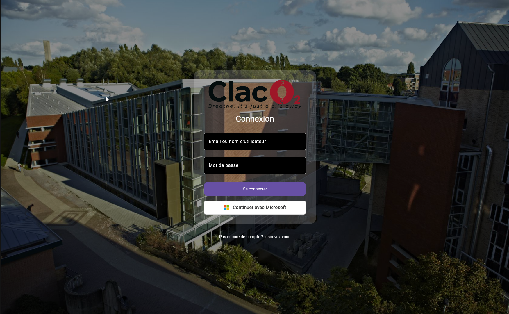

- Écran : [LoginScreen.kt](src/commonMain/kotlin/be/ecam/companion/ui/screens/LoginScreen.kt)
- Composants : [EcamBackground.kt](src/commonMain/kotlin/be/ecam/companion/ui/components/EcamBackground.kt), `MicrosoftSignInButton` (dans [LoginScreen.kt](src/commonMain/kotlin/be/ecam/companion/ui/screens/LoginScreen.kt))
- Modifiable :
  - états `email`/`password`
  - validation dans `onLoginClick`
  - gestion d’erreur (`errorMessage`) et chargement (`isLoading`)
  - bouton Microsoft (`MicrosoftSignInButton`)
  - URL OAuth via `loginUrlGenerator` et `navigateToUrl`
  - styles dans `LoginCard` et `MicrosoftSignInButton`
- Améliorations futures :
  - supprimer l’inscription locale et forcer Microsoft
  - exploiter plus d’attributs Microsoft pour préremplir le profil et faire le lien avec un compte existant dans la base de données avec l'adresse mail

15.2 Home
---

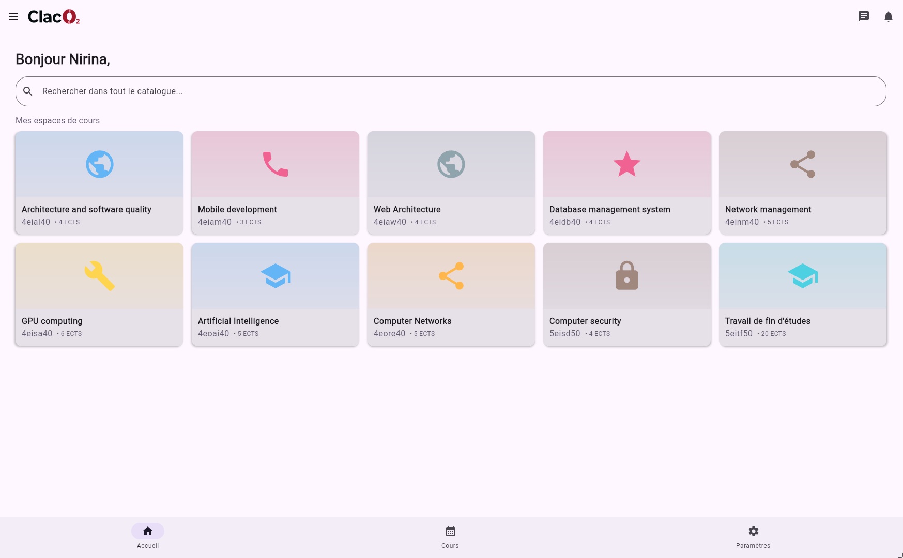

- Écran : [HomeScreen.kt](src/commonMain/kotlin/be/ecam/companion/ui/screens/HomeScreen.kt)
- Composants : [BottomBar.kt](src/commonMain/kotlin/be/ecam/companion/ui/components/BottomBar.kt), [TopBar.kt](src/commonMain/kotlin/be/ecam/companion/ui/components/TopBar.kt)
- Modifiable :
  - recherche (`searchQuery`, `isSearching`)
  - mapping des cours (`displayedItems`, `CourseDisplayItem`)
  - cartes (`CourseCard`, `getCourseTheme`)
  - grille (`LazyVerticalGrid`)
  - actions `onAddCourse`/`onRemoveCourse`
  - message d’état vide
  - boutons top/bottom
- Améliorations futures :
  - ajouter la sélection d’événements personnalisés par l’étudiant

15.3 Formations
---

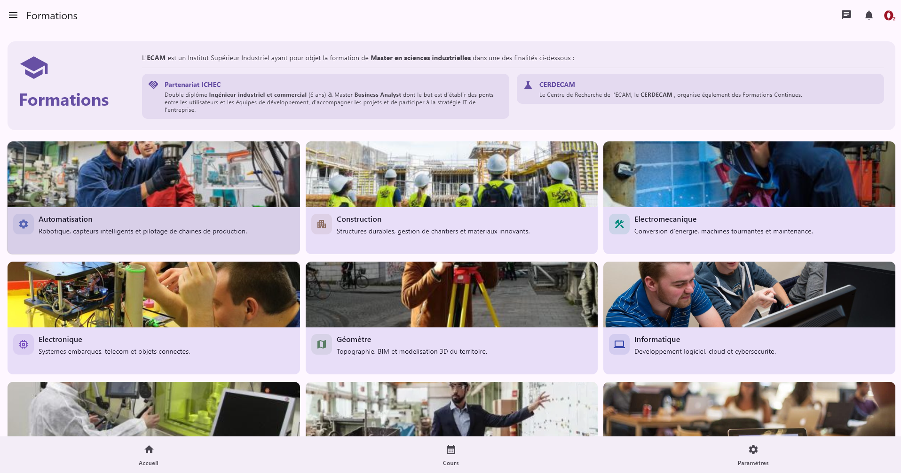

- Écran : [CoursesFormationScreen.kt](src/commonMain/kotlin/be/ecam/companion/ui/screens/CoursesFormationScreen.kt)
- Composants : [TopBar.kt](src/commonMain/kotlin/be/ecam/companion/ui/components/TopBar.kt)
- Modifiable :
  - intro (`IntroText`)
  - cartes info (`MiniInfoCard`)
  - sélection formation (`FormationSelector`)
  - cartes programme (`ProgramCard`)
  - blocs (`ProgramBlocks`, `BlockCard`, `BlockChip`)
  - navigation vers blocs ou fiches

15.4 Formations - Blocs
---

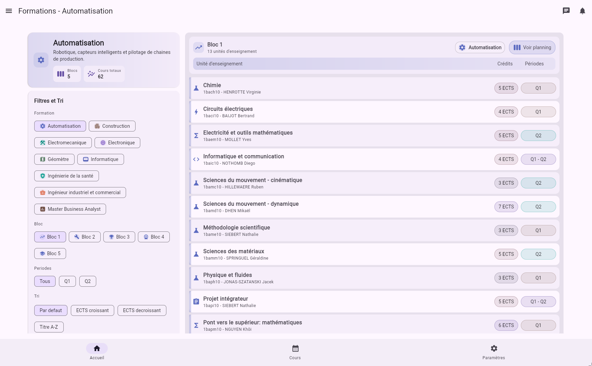

- Écran : [CoursesFormationBlocScreen.kt](src/commonMain/kotlin/be/ecam/companion/ui/screens/CoursesFormationBlocScreen.kt)
- Composants : listes internes de cours
- Modifiable :
  - filtres (`FilterPanel`)
  - détails bloc (`BlockDetails`)
  - entête (`TableHeader`)
  - lignes (`CourseRow`)
  - tri (`applySortAndFilter`, `SortOption.label`)
  - couleurs (`blockAccentColor`, `creditColorFor`, `periodColorFor`)

15.5 Fiche de cours (ECTS)
---

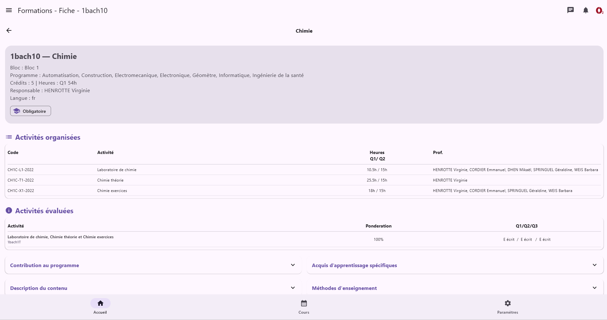

- Écran : [CoursesFicheScreen.kt](src/commonMain/kotlin/be/ecam/companion/ui/screens/CoursesFicheScreen.kt)
- Composants : sections de détail et cartes internes
- Modifiable :
  - chargement (`rememberCoursesDetails`)
  - rendu fiche (`CourseDetailScreen`)
  - sections (`SectionTitle`, `ExpandableSectionCard`, `SectionsResponsiveLayout`)
  - tables (`OrganizedActivitiesTable`, `EvaluatedActivitiesTable`)
  - format des listes (`toBulletPoints`)

15.6 Calendrier
---

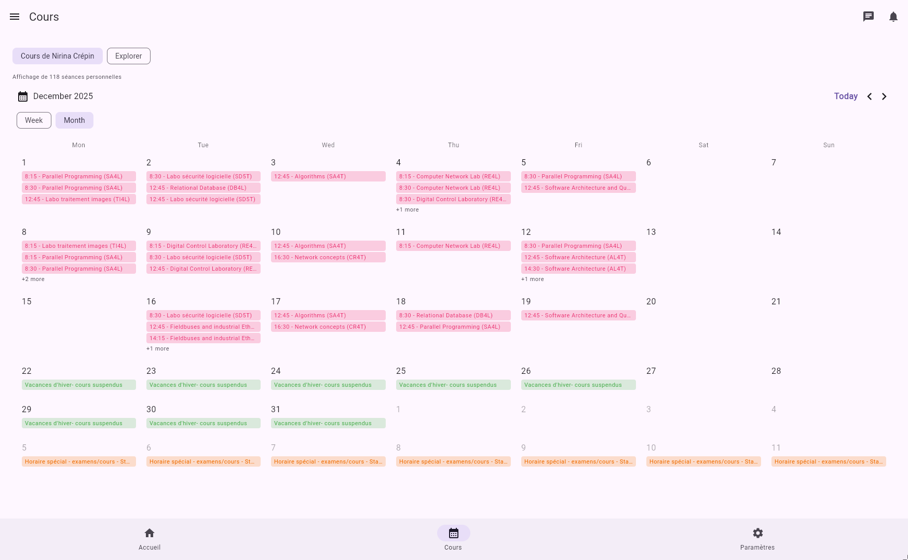

- Écran : [CalendarScreen.kt](src/commonMain/kotlin/be/ecam/companion/ui/screens/CalendarScreen.kt)
- Composants : [StudentCourseCalendar.kt](src/commonMain/kotlin/be/ecam/companion/ui/components/StudentCourseCalendar.kt), [CourseFilterBar.kt](src/commonMain/kotlin/be/ecam/companion/ui/components/CourseFilterBar.kt)
- Modifiable :
  - contrôles (`CalendarControls`)
  - entêtes (`WeekDayHeader`)
  - grille (`MonthGrid`, `WeekRow`, `DayCell`)
  - badges (`CalendarEventBadge`)
  - détails (`SelectedDayEvents`, `CalendarEventDetailCard`)
  - fusion (`mergeCalendarEvents`)
- Bugs à corriger :
  - lisibilité du calendrier sur smartphone (tailles, densité, règles d'affichage)
- Améliorations futures :
  - ajout d’événements personnalisés par étudiant et professeur
  - inrajouter un bouton avec l’occupation des locaux
  - rajouter un bouton avec l'horaire des professeurs avec une barre de recherche

15.7 Calendrier - fenêtre
---

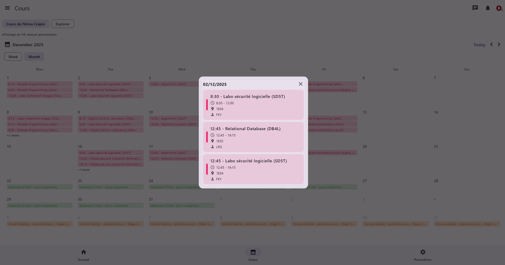

- Écran : [CalendarScreen.kt](src/commonMain/kotlin/be/ecam/companion/ui/screens/CalendarScreen.kt)
- Composants : `CalendarEventDetailCard`, `SelectedDayEvents`
- Modifiable :
  - contenu de la fenêtre (title, meta, description)
  - règles d’ouverture/fermeture de la fenêtre

15.8 Mon PAE
---

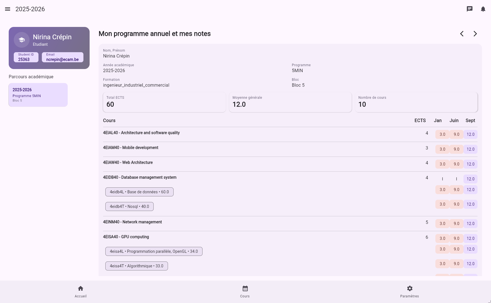

- Écran : [MonPaeScreen.kt](src/commonMain/kotlin/be/ecam/companion/ui/screens/MonPaeScreen.kt)
- Composants : tableaux internes, sections PAE
- Modifiable :
  - chargement serveur (`loadPaeFromServer`)
  - header (`PaeHeaderCard`, `ManualPaeHeaderCard`)
  - sélection d’année (`YearSelector`)
  - détails (`PaeDetailPane`, `ManualPaeDetailPane`)
  - stats (`StatsStrip`, `ManualStatsStrip`, `StatCard`)
  - tableau (`CoursesTable`, `CourseRow`, `ComponentRow`, `ScoreBadge`)
- Bugs à corriger :
  - gestion des points des étudiants

15.9 Professeurs - Liste
---

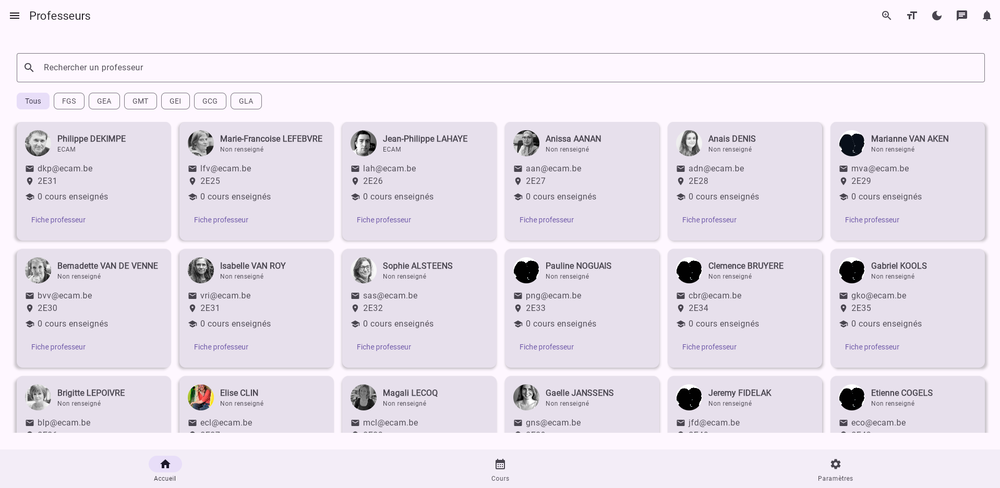

- Écran : [ProfessorsScreen.kt](src/commonMain/kotlin/be/ecam/companion/ui/screens/ProfessorsScreen.kt)
- Composants : [KamelImage.kt](src/commonMain/kotlin/be/ecam/companion/ui/components/KamelImage.kt)
- Modifiable :
  - écran principal (`ProfessorsMainScreen`)
  - cartes (`ProfessorCard`)
  - recherche/filtre
  - photos via [KamelImage.kt](src/commonMain/kotlin/be/ecam/companion/ui/components/KamelImage.kt)
  - couleurs via `randomColorFor`
- Améliorations futures :
  - cache des photos de professeurs
  - permettre à l'administrateur de rajouter des professeurs et de modifier leur données 

15.10 Professeurs - Fiche
---

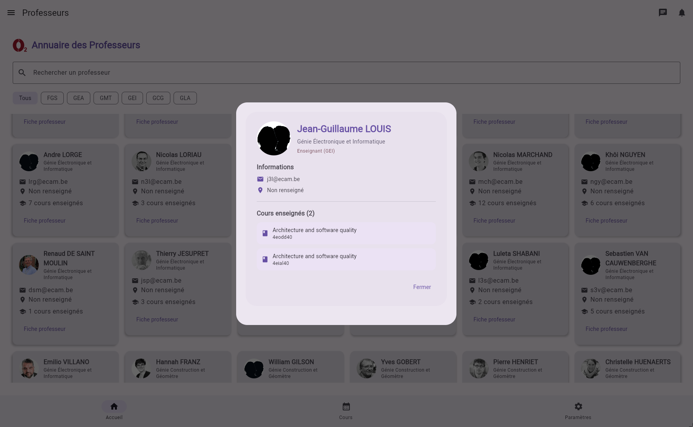

- Écran : [ProfessorsScreen.kt](src/commonMain/kotlin/be/ecam/companion/ui/screens/ProfessorsScreen.kt)
- Composants : sections internes de détail
- Modifiable :
  - popup (`ProfessorDetailsDialog`)
  - lignes info (`InfoRow`)
  - ordre des sections et données affichées
- Améliorations futures :
  - envoyer vers l'horaire du professeur avec un bouton

15.11 User Dashboard
---

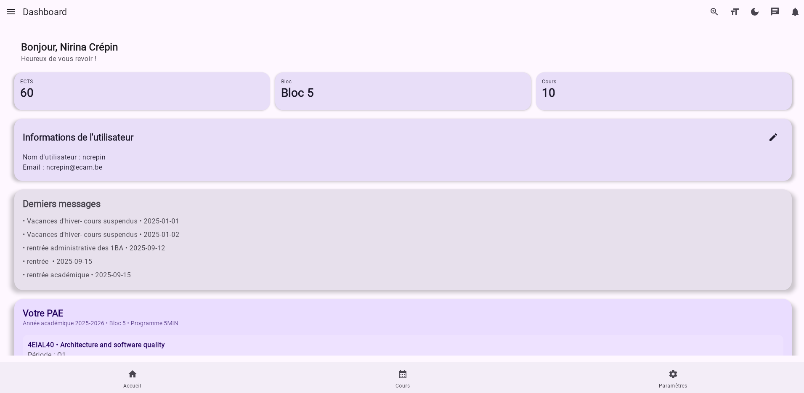

- Écran : [UserDashboardScreen.kt](src/commonMain/kotlin/be/ecam/companion/ui/screens/UserDashboardScreen.kt)
- Composants : widgets internes de résumé
- Modifiable :
  - cartes (`DashboardMiniCard`, `DashboardSectionCard`)
  - bloc utilisateur (`UserInfoCard`)
  - formulaire éditer (`EditUserDialog`)
  - contenu des métriques
- Améliorations futures :
  - proposer une vue rôle différente (admin, professor, student)
  - améliorer la mise en forme de cette page

15.12 Settings
---

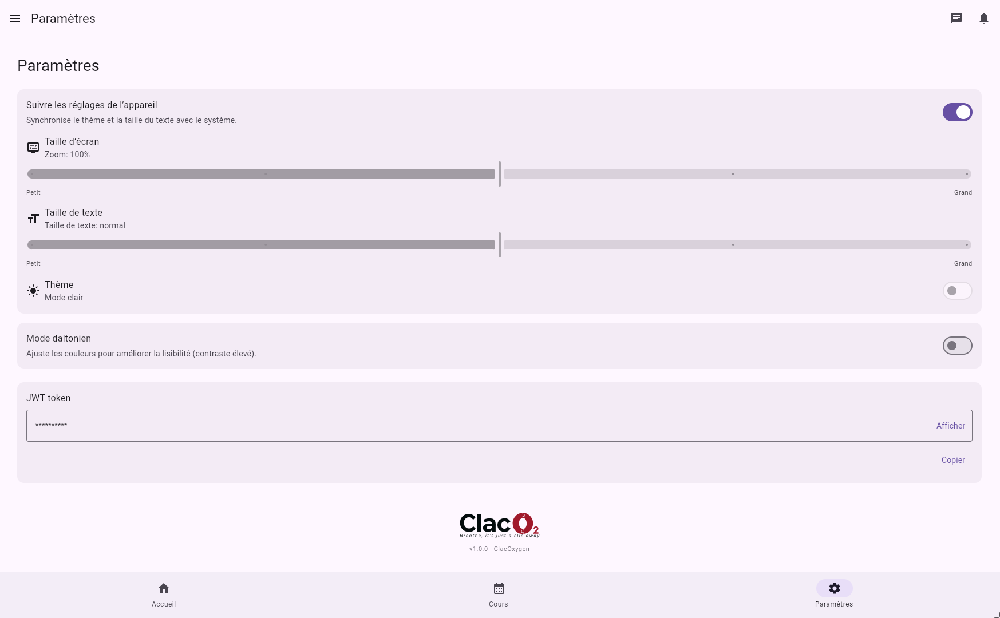

- Écran : [SettingsScreen.kt](src/commonMain/kotlin/be/ecam/companion/ui/screens/SettingsScreen.kt)
- Composants : switch, carte token
- Modifiable :
  - toggle "suivre les réglages système" (liaison avec `followSystemSettings`)
  - sliders de taille écran et taille de texte (`SettingsSliderRow`)
  - toggle de thème (`SettingsToggleRow`)
  - switch daltonien
  - carte token (afficher/masquer/copier)
  - libellés, descriptions et disposition dans [SettingsScreen.kt](src/commonMain/kotlin/be/ecam/companion/ui/screens/SettingsScreen.kt)
- Bugs à corriger :
  - retirer l'affichage du token JWT dans les paramètres
- Améliorations futures :
  - centraliser les réglages serveur (host/port)

15.13 Drawable
---

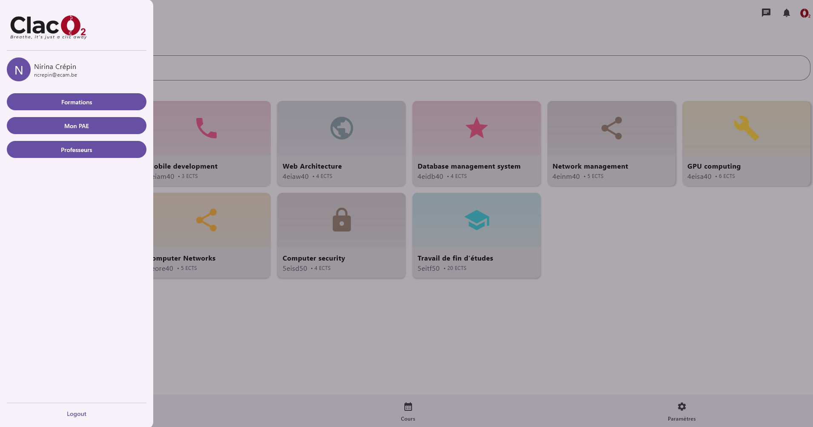

- Fichiers : [src/commonMain/composeResources/drawable/](src/commonMain/composeResources/drawable/)
- Modifiable :
  - images dans [src/commonMain/composeResources/drawable/](src/commonMain/composeResources/drawable/)
  - références dans les écrans, [KamelImage.kt](src/commonMain/kotlin/be/ecam/companion/ui/components/KamelImage.kt) et [EcamBackground.kt](src/commonMain/kotlin/be/ecam/companion/ui/components/EcamBackground.kt)
- Améliorations futures :
  - standardiser les tailles d’assets par plateforme
  - ajouter des variantes d’icônes pour l’accessibilité
  - afficher une image pour l'utilisateur
  - choisir entre un drawable et un bottom bar

15.14 Cours
---

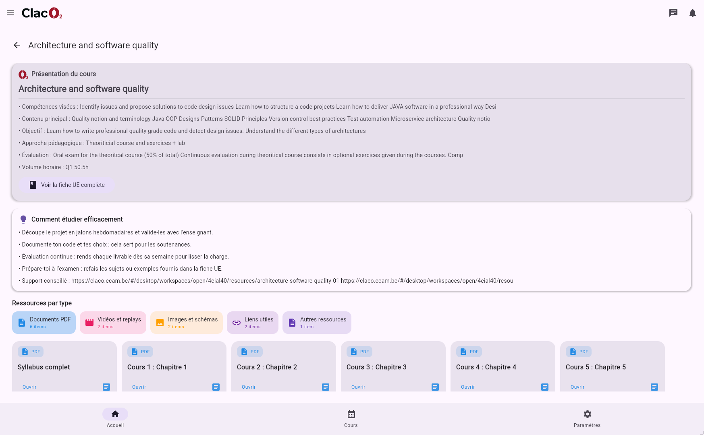

- Écran : [CoursesFormationScreen.kt](src/commonMain/kotlin/be/ecam/companion/ui/screens/CoursesFormationScreen.kt)
- Composants : listes de cours et cartes internes
- Modifiable :
  - affichage des cours dans [CoursesFormationScreen.kt](src/commonMain/kotlin/be/ecam/companion/ui/screens/CoursesFormationScreen.kt) (cartes programme, blocs, chips)
  - détails dans [CoursesFormationBlocScreen.kt](src/commonMain/kotlin/be/ecam/companion/ui/screens/CoursesFormationBlocScreen.kt) (tri, filtres, lignes)
- Améliorations futures :
  - permettre au professeur d'ajouter des ressources
  - permettre au professeur de moduler la page de son cours à sa convenance
  - permettre au professeur de poster des notifications
  - permettre au professeur de mettre des deadlines pour rendre des projets et les leir au calendrier de l'utilisateur et du professeur

15.15 Notifications
---

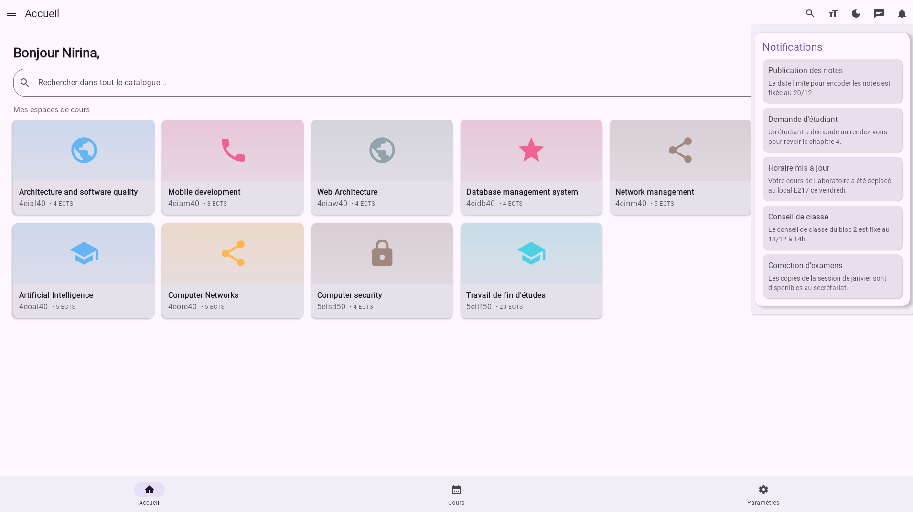

- Écran : notifications liées à la top bar dans [App.kt](src/commonMain/kotlin/be/ecam/companion/App.kt)
- Composants : [TopBar.kt](src/commonMain/kotlin/be/ecam/companion/ui/components/TopBar.kt), [NotificationWidget.kt](src/commonMain/kotlin/be/ecam/companion/ui/components/NotificationWidget.kt)
- Modifiable :
  - icône et comportement d'ouverture dans [TopBar.kt](src/commonMain/kotlin/be/ecam/companion/ui/components/TopBar.kt)
  - contenu des notifications dans [NotificationWidget.kt](src/commonMain/kotlin/be/ecam/companion/ui/components/NotificationWidget.kt)
- Améliorations futures :
  - brancher les notifications sur de vrais événements serveur
  - ajouter un historique consultable
  - lié les notifications directement à chaque cours dans la base de données
