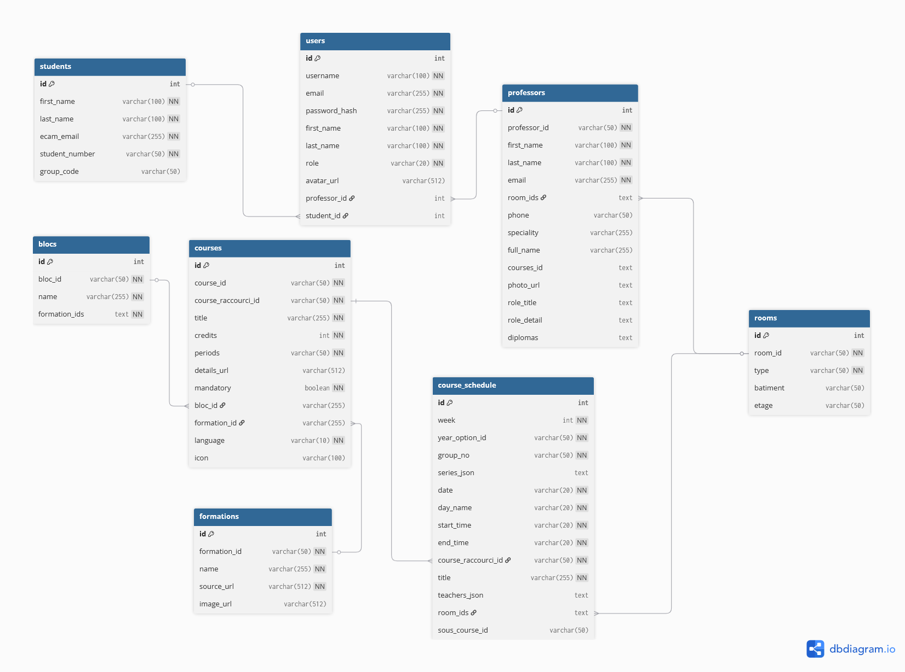
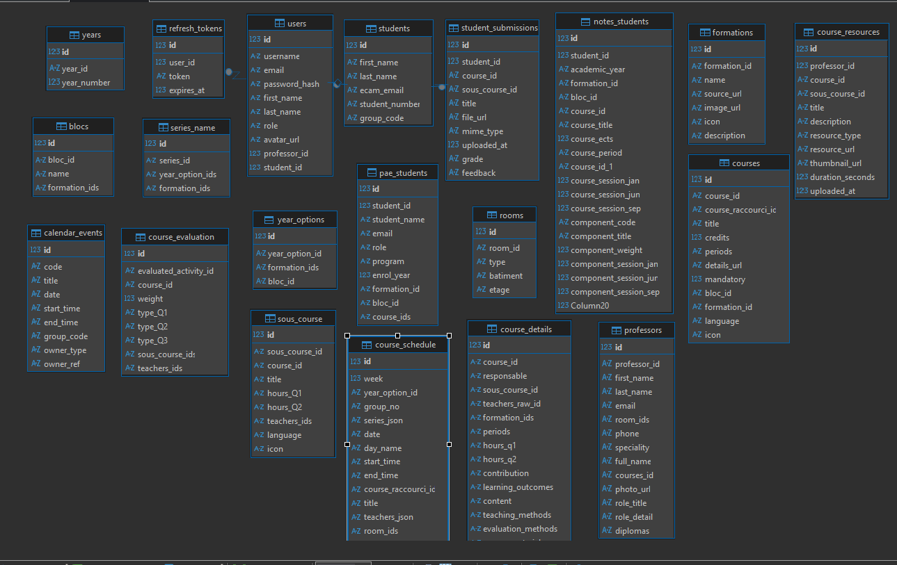

# ClacOxygen - Documentation Serveur

Ce dossier contient le serveur backend Ktor, qui expose l'API REST, gère la logique métier et maintient la base de données SQLite.

**Liens utiles :**
- [Retour à la documentation générale](../README.md)
- [Voir la documentation du Client (App)](../composeApp/README.md)

## Sommaire

1. [Objectif et contexte](#1-objectif-et-contexte)
2. [Rôle par rapport au frontend](#2-rôle-par-rapport-au-frontend)
3. [Architecture générale](#3-architecture-générale)
4. [Organisation du code et fichiers](#4-organisation-du-code-et-fichiers)
5. [Base de données et Modélisation](#5-base-de-données-et-modélisation)
6. [Accès aux données (Exposed)](#6-accès-aux-données-exposed)
7. [API, DTOs et Sérialisation](#7-api-dtos-et-sérialisation)
8. [Services et logique métier](#8-services-et-logique-métier)
9. [Sécurité et Authentification](#9-sécurité-et-authentification)
10. [Configuration et Point d'entrée](#10-configuration-et-point-dentrée)
11. [Dépendances et build.gradle](#11-dépendances-et-buildgradle)
12. [Principes SOLID appliqués](#12-principes-solid-appliqués)
13. [CI/CD (Intégration Continue)](#13-cicd-intégration-continue)
14. [Déploiement NixOS (Optionnel)](#14-déploiement-nixos-optionnel)
15. [Diagrammes et modélisation](#15-diagrammes-et-modélisation)
16. [Limites et évolutions](#16-limites-et-évolutions)

---

## 1. Objectif et contexte

Le backend constitue le cœur logique et technique de l'application. Il est responsable de la gestion des données académiques, de l'authentification, de l'application des règles métier et de l'exposition d'une API sécurisée.

Ce backend a été développé dans un **contexte académique**, avec pour objectif de mettre en pratique une architecture moderne, séparée et évolutive, tout en restant compatible avec les contraintes d'un prototype (utilisation de SQLite).

## 2. Rôle par rapport au frontend

Le backend joue le rôle de **source unique de vérité**. Le frontend ne communique jamais directement avec le fichier de base de données.

Ses responsabilités incluent :
- L'authentification (Email/Password + OAuth Microsoft).
- La validation stricte des données entrantes.
- L'application des règles métier (conflits d'horaire, calculs PAE).
- La transformation et la sécurisation des données via des DTO.

Le frontend se limite à l'affichage et à l'interaction, garantissant une indépendance totale entre l'interface et la logique de données.

## 3. Architecture générale

Le backend repose sur une **architecture en couches (layered architecture)** :

1.  **Routes** : Définissent les endpoints HTTP. Elles ne contiennent aucune logique métier complexe.
2.  **Services** : Cœur fonctionnel. Ils orchestrent la logique, valident les données et appellent la base.
3.  **Accès aux données (DAO/Exposed)** : Interaction type-safe avec SQLite.
4.  **DTO (Data Transfer Objects)** : Modèles exposés qui découplent l'API du schéma de base de données.

---

## 4. Organisation du code et fichiers

L'arborescence reflète la séparation des responsabilités. Seul les principaux fichiers y sont représentés.

### Structure des sources

```
server/
|-- build.gradle.kts                  # Configuration Gradle du module serveur
|-- default.nix                       # Packaging Nix du backend
|-- README.md                         # Cette documentation
|-- data/                             # Données exportées (CSV) et diagrammes
|-- image/                            # Captures d'écran et illustrations
|   |-- website/                      # Screenshots de l'application
|-- src/main/
|   |-- resources/
|   |   |-- application.conf          # Configuration principale Ktor
|   |   |-- logback.xml               # Configuration des logs
|   |   |-- static/                   # Fichiers servis statiquement
|   |   |   |-- auth-callback.html        # Page de redirection OAuth (Web)
|   |   |   |-- auth-callback-desktop.html # Page de redirection OAuth (Desktop)
|   |   |-- files/                    # Données JSON de seed
|   |   |   |-- ecam_calendar_courses_schedule_2025.json
|   |   |   |-- ecam_calendar_events_2025_2026.json
|   |   |   |-- ecam_courses_details_2025.json
|   |   |   |-- ecam_formations_2025.json
|   |   |   |-- ecam_professors_2025.json
|   |   |-- seed/
|   |   |   |-- admin.json            # Seed utilisateur admin
|   |-- kotlin/be/ecam/server/
|   |   |-- Application.kt            # Point d'entrée (Main)
|   |   |-- config/
|   |   |   |-- AppConfig.kt          # Maps application.conf en objets typés
|   |   |-- db/
|   |   |   |-- DatabaseFactory.kt    # Connexion SQLite et création des tables
|   |   |-- models/
|   |   |   |-- auth_models.kt        # Tables Users, RefreshTokens
|   |   |   |-- course_models.kt      # Tables Courses, CourseDetails, SousCourses
|   |   |   |-- formation_models.kt   # Tables Formations, Blocs, Years
|   |   |   |-- schedule_models.kt    # Tables CalendarEvents, CourseSchedule
|   |   |   |-- pae_models.kt         # Tables PaeStudents, NotesStudents
|   |   |   |-- resource_models.kt    # Table CourseResources
|   |   |-- routes/
|   |   |   |-- auth_routes.kt        # Endpoints /api/auth/*
|   |   |   |-- course_routes.kt      # Endpoints /api/courses/*
|   |   |   |-- formation_routes.kt   # Endpoints /api/formations/*, /api/blocs/*
|   |   |   |-- schedule_routes.kt    # Endpoints /api/calendar/*, /api/course-schedule/*
|   |   |   |-- professor_routes.kt   # Endpoints /api/professors/*
|   |   |   |-- pae_routes.kt         # Endpoints /api/pae-students/*, /api/notes-students/*
|   |   |-- services/
|   |   |   |-- AuthService.kt        # Logique de connexion/inscription
|   |   |   |-- CourseService.kt      # Logique gestion des cours
|   |   |   |-- FormationService.kt   # Logique formations et blocs
|   |   |   |-- ScheduleService.kt    # Logique calendrier et horaires
|   |   |   |-- ProfessorService.kt   # Logique annuaire professeurs
|   |   |-- security/
|   |   |   |-- PasswordHasher.kt     # Utilitaire BCrypt (optionnel, intégré dans AuthService)
|   |   |   |-- TokenService.kt       # Génération et vérification JWT
|-- src/test/
|   |-- kotlin/be/ecam/server/
|   |   |-- ApplicationTest.kt        # Tests d'intégration basiques
```

### Principaux fichiers expliqués

- **[Application.kt](src/main/kotlin/be/ecam/server/Application.kt)** : Initialise le serveur Ktor, charge les plugins (CORS, ContentNegotiation, Auth JWT), connecte la base de données et enregistre les routes.
- **[DatabaseFactory.kt](src/main/kotlin/be/ecam/server/db/DatabaseFactory.kt)** : Singleton qui établit la connexion SQLite directe et crée les tables via `SchemaUtils.create()`. Gère également les migrations simples (ajout de colonnes) et le seeding initial.
- **[models/](src/main/kotlin/be/ecam/server/models)** : Contient les objets `Table` et `IntIdTable` de Exposed (définition SQL) ainsi que les classes de données internes et les DTO.
- **[routes/](src/main/kotlin/be/ecam/server/routes)** : Définit les verbes HTTP (`get`, `post`, `put`, `delete`) et délègue le traitement aux Services. Transforme les exceptions en codes HTTP appropriés.
- **[services/](src/main/kotlin/be/ecam/server/services)** : Contient la logique métier pure. Ne connaît pas HTTP, uniquement des objets métier.

---

## 5. Base de données et Modélisation

La base de données est **SQLite**.
Ce choix assure la portabilité (un seul fichier [data/app.db](data/app.db)) et ne nécessite aucune installation serveur externe.

### Connexion

La connexion est établie directement via le driver JDBC SQLite, sans pool de connexions :

```kotlin
Database.connect(url, driver = "org.sqlite.JDBC")
```

Les transactions sont gérées explicitement via le bloc `transaction { ... }` de Exposed.

**Note** : Le projet n'utilise pas de pool de connexions (comme HikariCP). La connexion SQLite est directe, ce qui est suffisant pour un prototype à faible concurrence.

### Modélisation

Le modèle distingue :
- **Identifiants techniques** (`id` auto-incrémentés) pour les relations internes.
- **Identifiants métier** (codes uniques comme `Q2`, `4MIN`) pour la logique utilisateur.

## 6. Accès aux données (Exposed)

L'accès se fait via **JetBrains Exposed**, un ORM/DSL Kotlin.

Avantages :
- Requêtes type-safe (vérifiées à la compilation).
- Pas de SQL brut (sauf cas exceptionnels pour les migrations).
- Gestion transparente des transactions.

Chaque table est un objet Kotlin héritant de `Table` ou `IntIdTable`. Les résultats (`ResultRow`) sont immédiatement convertis en objets métier ou DTO.

## 7. API, DTOs et Sérialisation

La communication est exclusivement en **JSON** via **Kotlinx Serialization**.

Les **DTO** (Data Transfer Objects) sont cruciaux :
- Ils masquent les données sensibles (hash, sels).
- Ils stabilisent l'API : si la DB change, le DTO reste constant.
- Ils formatent les données pour l'UI (listes imbriquées, dates lisibles).

Une route renvoie toujours un DTO ou une liste de DTOs, jamais une entité de base de données brute.

### Exemples de formats JSON

**Authentification**

```json
// POST /api/auth/register
{ "username": "john", "email": "john@ecam.be", "password": "secret123" }

// POST /api/auth/login
{ "emailOrUsername": "john@ecam.be", "password": "secret123" }

// Réponse Auth (login/register)
{
  "user": {
    "id": 1,
    "username": "john",
    "email": "john@ecam.be",
    "role": "USER",
    "avatarUrl": null,
    "firstName": "John",
    "lastName": "Doe"
  },
  "message": "Connexion OK",
  "accessToken": "eyJhbGciOiJIUzI1NiIs...",
  "refreshToken": "eyJhbGciOiJIUzI1NiIs..."
}

// POST /api/auth/refresh
{ "refreshToken": "eyJhbGciOiJIUzI1NiIs..." }
```

**Cours**

```json
// GET /api/courses
[
  {
    "id": 453,
    "courseId": "UB4T",
    "courseRaccourciId": "UB4T",
    "title": "Urbanisme",
    "credits": 5,
    "periods": "Q2",
    "detailsUrl": "https://www.ichec.be/fr/master-business-analyst-en-alternance-ichec-ecam",
    "mandatory": true,
    "blocId": "bloc_18",
    "formationId": "business_analyst",
    "language": "FR",
    "icon": "Build"
  }
]
```

**Rôles utilisateur** : `USER`, `ADMIN`

## 8. Services et logique métier

Les services centralisent l'intelligence du backend :
- **AuthService** : Vérifie mots de passe, génère tokens, gère l'inscription.
- **CourseService** : Gère le catalogue, les prérequis, les crédits.
- **ScheduleService** : Gère les conflits horaire et le filtrage.

Le découpage Service/Route permet de tester la logique métier sans lancer de serveur HTTP.

## 9. Sécurité et Authentification

La sécurité repose sur **JWT (JSON Web Token)**.

Flux :
1.  **Login** : L'utilisateur envoie ses crédits ou un code OAuth.
2.  **Vérification** : Le backend valide et génère un `AccessToken` (15min) et un `RefreshToken` (7 jours).
3.  **Stockage** : 
    - Le Refresh Token est haché/stocké en DB pour permettre la révocation.
    - Pour le Web, le Refresh Token est envoyé dans un **Cookie HttpOnly Secure**.
4.  **Rotation** : À chaque utilisation du refresh token, un nouveau couple Access/Refresh est généré (Refresh Token Rotation).

Les mots de passe sont hachés avec **BCrypt** avant stockage.

## 10. Configuration et Point d'entrée

`Application.kt` configure :
1.  **Plugins** : Logs, CORS (Cross-Origin), ContentNegotiation (JSON).
2.  **Base de données** : Appel à `DatabaseFactory.init()`.
3.  **Routing** : Définition de l'arborescence URL.

Le serveur écoute sur le port défini par la variable d'environnement `PORT` (défaut `28088`).

### Variables d'environnement

Le serveur utilise les variables d'environnement suivantes :

| Variable | Fichier | Description | Défaut |
|----------|---------|-------------|--------|
| `PORT` | [`AppConfig.kt`](src/main/kotlin/be/ecam/server/config/AppConfig.kt) | Port d'écoute du serveur | `28088` |
| `APP_DOMAIN` | [`AppConfig.kt`](src/main/kotlin/be/ecam/server/config/AppConfig.kt) | Domaine de l'application | `localhost` |
| `APP_BASE_URL` | [`AppConfig.kt`](src/main/kotlin/be/ecam/server/config/AppConfig.kt) | URL de base (ex: `https://clacoxygen.msrl.be`) | Construit depuis domain |
| `DEV_MODE` | [`AppConfig.kt`](src/main/kotlin/be/ecam/server/config/AppConfig.kt) | Active le mode développement (`true`/`false`) | `false` |
| `JWT_SECRET` | [`jwtConfig.kt`](src/main/kotlin/be/ecam/server/security/jwtConfig.kt) | Secret JWT (dev/docker) | Fallback dev |
| `JWT_SECRET_FILE` | [`jwtConfig.kt`](src/main/kotlin/be/ecam/server/security/jwtConfig.kt) | Chemin vers fichier secret JWT (prod/sops) | - |
| `MS_CLIENT_ID` | [`microsoftConfig.kt`](src/main/kotlin/be/ecam/server/security/microsoftConfig.kt) | Client ID Microsoft OAuth (dev) | - |
| `MS_CLIENT_ID_FILE` | [`microsoftConfig.kt`](src/main/kotlin/be/ecam/server/security/microsoftConfig.kt) | Chemin fichier Client ID (prod/sops) | - |
| `MS_CLIENT_SECRET` | [`microsoftConfig.kt`](src/main/kotlin/be/ecam/server/security/microsoftConfig.kt) | Client Secret Microsoft (dev) | - |
| `MS_CLIENT_SECRET_FILE` | [`microsoftConfig.kt`](src/main/kotlin/be/ecam/server/security/microsoftConfig.kt) | Chemin fichier Client Secret (prod/sops) | - |
| `MS_REDIRECT_URI` | [`microsoftConfig.kt`](src/main/kotlin/be/ecam/server/security/microsoftConfig.kt) | URI de redirection OAuth | `{APP_BASE_URL}/api/auth/microsoft/callback` |

> [!NOTE]
> Les variables `*_FILE` sont conçues pour l'intégration avec **sops-nix** en production.
> En développement, utilisez directement `JWT_SECRET`, `MS_CLIENT_ID` et `MS_CLIENT_SECRET`.

### Seeding initial

Au démarrage, [`DatabaseFactory.init()`](src/main/kotlin/be/ecam/server/db/DatabaseFactory.kt) :
1. Crée les tables via `SchemaUtils.create()` si elles n'existent pas.
2. Exécute des migrations simples (ajout de colonnes `avatar_url`, `icon`).
3. Crée un **utilisateur admin par défaut** si la table `users` est vide :
   - Email : `admin@example.com`
   - Mot de passe : `1234`
   - Rôle : `ADMIN`

> [!IMPORTANT]
> Le seeding complet depuis les fichiers JSON (`DatabaseSeeder.seedAll()`) est **commenté** dans le code par défaut.
> Pour peupler la base avec les données académiques complètes, il faut soit :
> - Décommenter l'appel dans [`DatabaseFactory.kt`](src/main/kotlin/be/ecam/server/db/DatabaseFactory.kt)
> - Importer manuellement les CSV depuis le dossier [data/](data/)

---

## 11. Dépendances et build.gradle

La gestion des dépendances est assurée via **Gradle**.
Le fichier `build.gradle` définit l'ensemble des bibliothèques nécessaires au fonctionnement du backend.

Les principales dépendances utilisées sont :
- **Ktor** : framework serveur HTTP.
- **Kotlinx Serialization** : sérialisation JSON.
- **Exposed** : ORM / DSL SQL pour Kotlin.
- **SQLite JDBC** : accès à la base de données.
- **JWT (Auth0)** : authentification sécurisée.
- **BCrypt** : hachage des mots de passe.
- **Logback** : gestion des logs.

Ce découpage permet :
- une gestion claire des responsabilités de chaque bibliothèque.
- une maintenance simplifiée.
- une évolution contrôlée du projet.

Les versions des dépendances sont choisies pour assurer la stabilité et la compatibilité de l'ensemble du backend.

## 12. Principes SOLID appliqués

Le backend a été conçu en appliquant plusieurs **principes SOLID**, afin d'assurer une architecture claire, maintenable et évolutive.

- **Single Responsibility Principle (SRP)**
  Chaque composant a une responsabilité unique :
    - les routes gèrent uniquement les requêtes HTTP,
    - les services contiennent la logique métier,
    - les modèles définissent la structure des données,
    - les DTO définissent les structures exposées.

- **Open/Closed Principle (OCP)**
  Le code est ouvert à l'extension mais fermé à la modification. De nouvelles fonctionnalités peuvent être ajoutées sans modifier le comportement existant.

- **Liskov Substitution Principle (LSP)**
  Les abstractions et structures utilisées permettent de remplacer des implémentations sans casser le fonctionnement global.

- **Interface Segregation Principle (ISP)**
  Les composants n'exposent que les méthodes nécessaires, évitant des dépendances inutiles.

- **Dependency Inversion Principle (DIP)**
  Les couches haut niveau (routes, services) ne dépendent pas directement des détails d'implémentation bas niveau, mais de contrats clairement définis.

Ces principes renforcent la qualité du code et facilitent la compréhension du projet par des développeurs tiers.

---

## 13. CI/CD (Intégration Continue)

Le projet utilise **GitHub Actions** pour assurer la qualité et l'intégration continue.
Le workflow est défini dans `.github/workflows/build-wasm.yml`.

Il comprend les étapes suivantes :
1.  **Détection des changements** : Analyse quels dossiers ont été modifiés (frontend vs backend).
2.  **Build WASM** : Si le client change, il génère le bundle WebAssembly de production.
3.  **Build Backend** : Compile le serveur et génère le fichier "Fat JAR" (shadowJar) pour vérifier l'intégrité du code serveur.
4.  **Auto-commit** : Si le bundle Wasm a changé sur la branche principale, il met à jour automatiquement le dossier `wasm-dist/` utilisé pour le déploiement statique.

## 14. Déploiement NixOS (Optionnel)

Le projet propose une intégration avec l'écosystème Nix pour garantir la reproductibilité du build et faciliter le déploiement. Bien que le serveur puisse être déployé via un JAR standard ou un conteneur Docker classique, l'approche NixOS est privilégiée pour l'infrastructure de production via un Flake.

### Fichier Nix de configuration (exemple)

```nix
{
  config,
  lib,
  pkgs,
  inputs,
  ...
}:

{
  imports = [
    inputs.clacoxygen.nixosModules.default
  ];

  # Secrets gérés par sops
  sops.secrets.clacoxygen_jwt_secret = {
    owner = "clacoxygen";
    mode = "0400";
  };
  sops.secrets.clacoxygen_ms_client_id = {
    owner = "clacoxygen";
    mode = "0400";
  };
  sops.secrets.clacoxygen_ms_client_secret = {
    owner = "clacoxygen";
    mode = "0400";
  };

  # Service Clacoxygen
  services.clacoxygen = {
    enable = true;
    port = 28088;
    domain = "clacoxygen.msrl.be";
    user = "clacoxygen";
    group = "clacoxygen";

    # obligatoire en prod (module assert)
    jwtSecretFile = config.sops.secrets.clacoxygen_jwt_secret.path;
    msClientIdFile = config.sops.secrets.clacoxygen_ms_client_id.path;
    msClientSecretFile = config.sops.secrets.clacoxygen_ms_client_secret.path;

    # Nginx / ACME
    nginx = {
      enable = true;
      enableACME = true;
      # extraConfig = '' ... '';
    };

    # Optionnel : override du redirect URI Microsoft (si besoin)
    # microsoftRedirectUri = "https://autre-domaine/callback";
  };
}
```

L'import flake correspond généralement à :
`clacoxygen.url = "github:RISE-Remote-Intranet-School-Environment/ClacOxygen/";`.

---

## 15. Diagrammes et modélisation

Afin de faciliter la compréhension du backend, plusieurs types de diagrammes ont été utilisés.

### Diagramme de relations (modele de données)

Deux représentations complémentaires sont fournies :

**Diagramme logique (dbdiagram.io)**

Il met en évidence les entités principales du backend ainsi que leurs relations métier.



**Diagramme physique (DBeaver)**

Généré automatiquement à partir de la base SQLite, il reflète exactement la structure réelle des tables et les clés étrangères effectivement implémentées.



Ces deux diagrammes sont complémentaires :
- le diagramme logique explique l'architecture et les choix conceptuels,
- le diagramme physique montre la réalité technique de la base.

### Diagramme de sequence

Un diagramme de séquence illustre le fonctionnement des flux principaux, notamment :
- l'authentification utilisateur (login + JWT),
- l'accès à une route protégée.

```
┌────────┐          ┌────────┐          ┌─────────┐          ┌────────┐
│ Client │          │ Routes │          │ Service │          │   DB   │
└───┬────┘          └───┬────┘          └────┬────┘          └───┬────┘
    │                   │                    │                   │
    │  POST /api/auth/login                  │                   │
    │  {email, password}                     │                   │
    │──────────────────>│                    │                   │
    │                   │                    │                   │
    │                   │  AuthService       │                   │
    │                   │  .login(email,pwd) │                   │
    │                   │───────────────────>│                   │
    │                   │                    │                   │
    │                   │                    │  SELECT user      │
    │                   │                    │  WHERE email=...  │
    │                   │                    │──────────────────>│
    │                   │                    │                   │
    │                   │                    │  User row         │
    │                   │                    │<──────────────────│
    │                   │                    │                   │
    │                   │                    │  Verify BCrypt    │
    │                   │                    │  hash(password)   │
    │                   │                    │                   │
    │                   │                    │  Generate JWT     │
    │                   │                    │  (access+refresh) │
    │                   │                    │                   │
    │                   │  TokenPair         │                   │
    │                   │<───────────────────│                   │
    │                   │                    │                   │
    │  200 OK           │                    │                   │
    │  {accessToken,    │                    │                   │
    │   refreshToken}   │                    │                   │
    │<──────────────────│                    │                   │
    │                   │                    │                   │
    │                   │                    │                   │
    │  GET /api/courses │                    │                   │
    │  Authorization:   │                    │                   │
    │  Bearer <token>   │                    │                   │
    │──────────────────>│                    │                   │
    │                   │                    │                   │
    │                   │  Ktor Auth Plugin  │                   │
    │                   │  Verify JWT        │                   │
    │                   │  signature + exp   │                   │
    │                   │                    │                   │
    │                   │  CourseService     │                   │
    │                   │  .getAllCourses()  │                   │
    │                   │───────────────────>│                   │
    │                   │                    │                   │
    │                   │                    │  SELECT * FROM    │
    │                   │                    │  courses          │
    │                   │                    │──────────────────>│
    │                   │                    │                   │
    │                   │                    │  Rows             │
    │                   │                    │<──────────────────│
    │                   │                    │                   │
    │                   │  List<CourseDTO>   │                   │
    │                   │<───────────────────│                   │
    │                   │                    │                   │
    │  200 OK           │                    │                   │
    │  [{course1},...]  │                    │                   │
    │<──────────────────│                    │                   │
    │                   │                    │                   │
```

Ce diagramme permet de visualiser clairement :
- l'interaction entre le frontend et le backend,
- le rôle des routes, services et mécanismes de sécurité,
- la circulation des données et des tokens.

---

## 16. Limites et évolutions

### Limites actuelles

Le backend répond aux besoins du projet académique, mais certaines limites techniques sont connues et assumées.

**Base de données**
- SQLite limite la concurrence en écriture.
- Absence de scalabilité horizontale.
- Relations complexes gérées côté application.

**Sécurité**
- Pas de rate limiting.

**Architecture**
- Backend monolithique.
- Absence de cache ou de file de messages.
- Couverture de tests partielle.

### Evolutions possibles

Avec plus de temps ou dans un contexte de production, plusieurs améliorations seraient envisageables :

- Migration vers PostgreSQL avec clés étrangères strictes.
- Ajout d'un cache Redis.
- Mise en place d'un RBAC (Role-Based Access Control) plus fin.
- Ajout de tests unitaires et d'intégration.

### Vision globale

Le backend a été conçu avec une vision évolutive. Les choix actuels ne bloquent pas une transition vers une architecture plus robuste et scalable.
