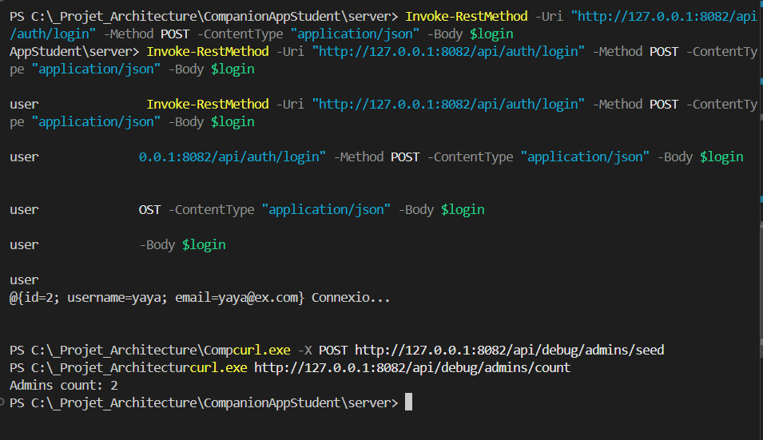
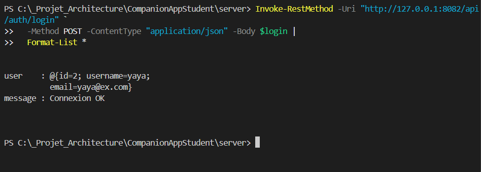

# Tout d'abord il faut connaitre ce qui se passe dans le dossier pour bien avancer

- En premier on a cette grande différence :
    - **build/** : dossier généré automatiquement par Gradle lors de la compilation (classes compilées, JAR, ressources copiées, rapports de tests…).  
       À ignorer dans le Git.

    - **bin/** : parfois généré par l’IDE ou Gradle (scripts de lancement).  
       On ne modifie rien manuellement ici.

    - **src/** : c’est *notre* espace de travail.  
      Il contient deux sous-parties standards :
        - **src/main/kotlin/** : le code de production (ton serveur Ktor).  
        - **src/main/resources/** : les ressources embarquées au runtime (fichiers de config, migrations SQL, favicon, etc.).  
        - **src/test/kotlin/** : les tests unitaires ou d’intégration.  
          -  On peut y tester une base SQLite en mémoire, par exemple.


### À la racine du module 

* **build.gradle.kts** : le “plan de construction” Gradle.  
  Il définit les dépendances, les plugins, la version du JDK, et les tâches.  
  - C’est ici qu’on ajoute Exposed, Flyway, HikariCP, ou les drivers SQLite/MySQL.

* **settings.gradle.kts** : (à la racine du projet, pas forcément dans `server/`)  
  Sert à déclarer les modules (ex: `:server`, `:client`) et le nom du projet.

* **gradlew / gradlew.bat / gradle/** :  
  Le *wrapper* Gradle - à ne pas toucher.  
  Il garantit la même version de Gradle pour tout le monde.


### Arborescence `src/main/kotlin` (notre code)

Nous avons créé :  
`be/ecam/server/{Application.kt, db, models, routes, services}`

Rôle de chaque couche (simple et propre) :

* **Application.kt**  
  - Point d’entrée du serveur Ktor.  
  Il lit `application.conf`, initialise la DB (`DatabaseFactory.connect()`), installe les plugins (ContentNegotiation, CORS, etc.) et enregistre les routes.

* **db/**  
  - Code bas niveau d’accès à la base de données.  
  Contient par exemple :
  - `DatabaseFactory.kt` (config SQLite, Exposed, etc.)
  - éventuellement un dossier `dao/` ou `repository/` pour séparer la logique SQL.

* **models/**  
  - Définit les structures de données :
  - Tables Exposed (ex: `object Users : IntIdTable`)
  - Classes DAO (ex: `class User : IntEntity`)
  - DTOs (ex: `data class UserDTO`) pour la communication JSON.

* **services/**  
  - Contient la logique métier.  
  Combine les opérations, valide les entrées, appelle la DB, etc.  
  Ex: `AuthService.loginUser()`, `ScheduleService.getAll()`.

* **routes/**  
  -  Déclare les routes HTTP Ktor (ex: `Route.authRoutes()`, `Route.usersRoutes()`),  
  qui reçoivent/renvoient du JSON et appellent les services.

---

# Pour commencer sur le projet, on avance étape par étape

---

## Étape 1 - Dépendances et configuration JSON

**But :** permettre à Ktor d’envoyer et recevoir des objets JSON (DTO).

1) Dans `server/build.gradle.kts`, ajouter :

```kotlin
dependencies {
    implementation("io.ktor:ktor-server-content-negotiation:3.0.0")
    implementation("org.jetbrains.kotlinx:kotlinx-serialization-json:1.7.3")
    implementation("at.favre.lib:bcrypt:0.10.2") // hash des mots de passe qu'il faut qu'on tienne compte sinon pas bonnnnnnnnn
}

```

2) Dans (Application.kt), installer la sérialisation JSON:

```kotlin
import io.ktor.server.plugins.contentnegotiation.*
import io.ktor.serialization.kotlinx.json.*

install(ContentNegotiation) { json() }

```

Test rapide : on lance le serveur, aucune erreur. Tout est parfait, on passe à l'étape 2.


---

## Étape 2 - Mise en place de la base de données SQLite

**Objectif :** avoir une base locale simple, sans Docker.

1) Créer DatabaseFactory.kt dans (server/src/main/kotlin/be/ecam/server/db/)

```kotlin
package be.ecam.server.db

import org.jetbrains.exposed.sql.Database
import org.jetbrains.exposed.sql.SchemaUtils
import org.jetbrains.exposed.sql.transactions.transaction
import java.io.File

object DatabaseFactory {
    fun connect() {
        val dbFolder = File("data")
        if (!dbFolder.exists()) {
            dbFolder.mkdirs()
            println("Created data directory")
        }

        val dbPath = File(dbFolder, "app.db").absolutePath
        val url = "jdbc:sqlite:$dbPath"

        Database.connect(url, driver = "org.sqlite.JDBC")
        println("Connected to SQLite: $url")
    }
}

```

2) Ajouter dans Application.kt :

```kotlin
be.ecam.server.db.DatabaseFactory.connect()
```

3) Lancer :

```bash
.\gradlew :server:run
```
La console doit afficher :

```bash
Connected to SQLite: jdbc:sqlite:./data/app.db
```

Le fichier data/app.db apparaît, même vide.(Base bien initialisée.)


---

## Étape 3 - Création du modèle Admin

**But :** première table dans la DB.

1) Fichier Admin.kt (dans server/src/main/kotlin/be/ecam/server/models/)

```kotlin
package be.ecam.server.models

import org.jetbrains.exposed.dao.IntEntity
import org.jetbrains.exposed.dao.IntEntityClass
import org.jetbrains.exposed.dao.id.IntIdTable

object AdminTable : IntIdTable("admins") {
    val username = varchar("username", 50).uniqueIndex()
    val email = varchar("email", 100).uniqueIndex()
    val password = varchar("password", 255)
}

class Admin(id: org.jetbrains.exposed.dao.id.EntityID<Int>) : IntEntity(id) {
    companion object : IntEntityClass<Admin>(AdminTable)
    var username by AdminTable.username
    var email by AdminTable.email
    var password by AdminTable.password
}
```

2) Vérifier que le schéma est appliqué dans DatabaseFactory.connect() :

```kotlin
transaction {
    SchemaUtils.create(AdminTable)
    println(" AdminTable created.")
}
```

3) Relancer :

```bash
.\gradlew :server:run
```

Une table admins doit apparaître dans data/app.db


---

## Étape 4 - Routes de test (“debug”) pour vérifier la DB

**But :** tester l’écriture et la lecture dans la base sans interface.

1) Ajouter dans Application.kt (dans route("/api") { ... }) :

```kotlin
get("/debug/admins/count") {
    val n = org.jetbrains.exposed.sql.transactions.transaction {
        be.ecam.server.models.Admin.all().count()
    }
    call.respondText("Admins count: $n")
}

post("/debug/admins/seed") {
    val id = org.jetbrains.exposed.sql.transactions.transaction {
        val a = be.ecam.server.models.Admin.new {
            username = "admin"
            email = "admin@example.com"
            password = "1234" // provisoire
        }
        a.id.value
    }
    call.respondText("Seeded admin with ID: $id")
}
```

2) Lancer le serveur :
```bash
.\gradlew :server:run
```

3) Dans un autre terminal PowerShell :
```powershell
# Ajouter un admin de test
curl.exe -X POST http://127.0.0.1:8082/api/debug/admins/seed

# Vérifier le nombre d’administrateurs
curl.exe http://127.0.0.1:8082/api/debug/admins/count
```

Résultat attendu :
```yaml
Seeded admin with ID: 1
Admins count: 1
```



---
 
---

---

## Étape 5 - Authentification (register / login)

**Objectif :** exposer deux endpoints JSON :
- POST /api/auth/register : créer un admin avec mot de passe haché.
- POST /api/auth/login : vérifier email/username + mot de passe.

1) DTOs (reçus/envoyés)

Créer server/src/main/kotlin/be/ecam/server/models/authDTOs.kt :

```kotlin
package be.ecam.server.models

import kotlinx.serialization.Serializable

@Serializable
data class RegisterRequest(
    val username: String,
    val email: String,
    val password: String
)

@Serializable
data class LoginRequest(
    val emailOrUsername: String,
    val password: String
)

@Serializable
data class AuthUserDTO(
    val id: Int,
    val username: String,
    val email: String
)

@Serializable
data class AuthResponse<T>(
    val user: T,
    val message: String
)
```

2) Service d’authentification

Créer server/src/main/kotlin/be/ecam/server//services/authService.kt :

```kotlin
package be.ecam.server.services

import at.favre.lib.crypto.bcrypt.BCrypt
import be.ecam.server.models.*
import org.jetbrains.exposed.sql.SqlExpressionBuilder.eq
import org.jetbrains.exposed.sql.or
import org.jetbrains.exposed.sql.transactions.transaction

object AuthService {

    fun register(req: RegisterRequest): AuthUserDTO = transaction {
        // Unique username/email
        val exists = Admin.find {
            (AdminTable.email eq req.email) or (AdminTable.username eq req.username)
        }.firstOrNull()
        require(exists == null) { "Utilisateur déjà existant" }

        val hashed = BCrypt.withDefaults().hashToString(12, req.password.toCharArray())

        val a = Admin.new {
            username = req.username
            email = req.email
            password = hashed
        }
        AuthUserDTO(a.id.value, a.username, a.email)
    }

    fun login(req: LoginRequest): AuthUserDTO = transaction {
        val a = Admin.find {
            (AdminTable.email eq req.emailOrUsername) or
            (AdminTable.username eq req.emailOrUsername)
        }.firstOrNull() ?: error("Utilisateur introuvable")

        val ok = BCrypt.verifyer().verify(req.password.toCharArray(), a.password).verified
        require(ok) { "Mot de passe incorrect" }

        AuthUserDTO(a.id.value, a.username, a.email)
    }
}
```

3) Routes HTTP

Créer server/src/main/kotlin/be/ecam/server/routes/authRoutes.kt :

```kotlin
package be.ecam.server.routes

import be.ecam.server.models.*
import be.ecam.server.services.AuthService
import io.ktor.server.application.call
import io.ktor.server.request.receive
import io.ktor.server.response.respond
import io.ktor.server.routing.Route
import io.ktor.server.routing.post

fun Route.authRoutes() {

    post("/auth/register") {
        val req = call.receive<RegisterRequest>()
        val user = AuthService.register(req)
        call.respond(AuthResponse(user, "Compte créé"))
    }

    post("/auth/login") {
        val req = call.receive<LoginRequest>()
        val user = AuthService.login(req)
        call.respond(AuthResponse(user, "Connexion OK"))
    }
}
```

4) Brancher les routes dans Application.kt

Dans ton routing { route("/api") { ... } }, ajoute :

```kotlin
import be.ecam.server.routes.authRoutes

route("/api") {
    // ... (om met les autres routes debug/schedule)
    authRoutes()
}
```

5) Tests (PowerShell)

Register (création de compte) :

```powershell
$body = @{
  username = "yaya"
  email    = "yaya@ex.com"
  password = "1234"
} | ConvertTo-Json

Invoke-RestMethod -Uri "http://127.0.0.1:8082/api/auth/register" -Method POST -ContentType "application/json" -Body $body
```

Login (email OU username) :

```powershell
$login = @{
  emailOrUsername = "yaya@ex.com" 
  password        = "1234"
} | ConvertTo-Json

Invoke-RestMethod -Uri "http://127.0.0.1:8082/api/auth/login" -Method POST -ContentType "application/json" -Body $login

```

Résultat attendu :

```json
// register
{ "user": {"id": 1, "username": "yaya", "email": "yaya@ex.com"}, "message": "Compte créé" }

// login
{ "user": {"id": 1, "username": "yaya", "email": "yaya@ex.com"}, "message": "Connexion OK" }
```


---

## Étape 6 - NVérifications rapides (register / login)

### 6.1 Lancer le serveur

```powershell
.\gradlew :server:run
```
**Objectif :** éviter d’insérer par erreur des comptes en clair.

- Garde les routes debug dans Application.kt pendant que tu développes.

- Dès que register/login fonctionnent, supprime :
  - POST /api/debug/admins/seed

  - Ou ajoute un flag de dev pour les activer seulement en local.

Exemple (pseudo): 
```kotlin
if (environment.config.propertyOrNull("app.devMode")?.getString() == "true") {
    // activer /api/debug/*
}
```

---

## Étape 7 - (à suivre) Sécurisation par JWT

**But (prochaine section) :** 
- Ajouter un token JWT renvoyé par login
- Créer une route protégée /api/me qui nécessite le token
- Ajouter un plugin Ktor Authentication avec jwt { ... }

On traitera JWT juste après (clé secrète, issuer/audience, durée, middleware, test).

---

## vendredi 14/11/25
- En premier j'ai récupérer les commit depuis master dossier `composeApp\src\commonMain\composeResources\files`

- En suite comme *Objectif :* je dois terminier:
- le `CRUD` côté Admin
- Ajouter les models des files ainsi les jsons.
- Date : `avant : le 21/11/25`

---

## Étape 8 – CRUD Admin (/api/admins)

**Objectif :** exposer des routes REST pour gérer les administrateurs :
- lister
- récupérer par id
- mettre à jour partiellement
- supprimer

### 8.1 Fichiers impliqués

- `models/admin.kt`  
  -  Table Exposed `AdminTable` + Entity `Admin`.

- `models/adminDTOS.kt`  
  -  `AdminDTO` (réponse API)  
  - `UpdateAdminRequest` (corps JSON pour update partiel).

- `services/admin_service.kt`  
  -  `AdminService.getAllAdmins()`  
  -  `AdminService.getAdminById(id)`  
  -  `AdminService.updateAdmin(id, req)`  
  -  `AdminService.deleteAdmin(id)`  

- `routes/admin_routes.kt`  
  -  Déclare les routes `/api/admins/...`.

- `Application.kt`  
  -  Dans `routing { route("/api") { adminRoutes() } }`.

  ### 8.2 Routes Admin

#### GET /api/admins

Retourne la liste de tous les admins.

**Exemple (PowerShell) :**

```powershell
Invoke-RestMethod -Uri "http://127.0.0.1:8082/api/admins" -Method GET
```

Reponse : 

```json
[
  { "id": 1, "username": "yaya",  "email": "yaya@ex.com" },
  { "id": 2, "username": "bruno", "email": "bruno@ex.com" }
]

```

GET /api/admins/{id}

Retourne un admin spécifique.

```powershell
Invoke-RestMethod -Uri "http://127.0.0.1:8082/api/admins/1" -Method GET

```

Reponse : 

```json
{ "id": 1, "username": "yaya", "email": "yaya@ex.com" }


```

PATCH /api/admins/{id}

Met à jour partiellement un admin.
On envoie un UpdateAdminRequest :

```kotlin
@Serializable
data class UpdateAdminRequest(
    val username: String? = null,
    val email: String? = null,
    val password: String? = null
)
```
Seuls les champs non nuls sont modifiés.

Exemple : changer uniquement le username

```powershell
$update = @{ username = "admin_renamed" } | ConvertTo-Json

Invoke-RestMethod -Uri "http://127.0.0.1:8082/api/admins/1" `
  -Method PATCH -ContentType "application/json" -Body $update
```

Réponse : 
```json
{ "id": 1, "username": "admin_renamed", "email": "yaya@ex.com" }
```
* json invalide on aura 400 Données invalides
* Admin introuvable on aura 404 admin non trouvé

---

DELETE /api/admins/{id}

Supprime un admin par id.

```shell
Invoke-RestMethod -Uri "http://127.0.0.1:8082/api/admins/3" -Method DELETE
```
* Si l’admin existe : 200 "Admin supprimé"

* Si l’admin n’existe pas = 404 Admin introuvable

* ID invalide = 400 ID invalide


---

##  Mettre à jour ta section “tâches restantes”

À la fin de ton fichier tu peux maintenant mettre à jour :

```md
## État au 14/11/25

- [x] CRUD côté Admin (routes + service + tests PowerShell)
- [ ] Ajouter les models pour les files (documents / fichiers courses, etc.)
- [ ] Définir les JSON de seed / exemples de données
- [ ] (À venir) JWT + sécurisation des routes

```

